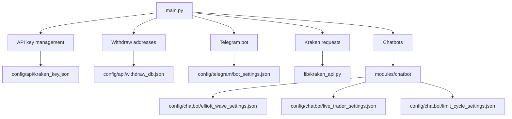

# Project Overview

This diagram shows the high level components of the project and how they relate
to the configuration files used for accessing the Kraken API and for running the
Telegram bot.

Additional strategy bots use JSON settings located in `config/chatbot/`. Along
with the Elliott wave example you can configure a continuously running
`LiveTraderBot` via `live_trader_settings.json` described in
`docs/live_trader_bot.md`. The new `LimitCycleBot` uses
`limit_cycle_settings.json` and is documented in `docs/limit_cycle_bot.md`.
