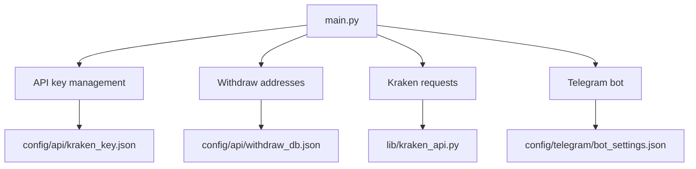

# Project Overview

```mermaid
flowchart TD
    A[main.py] --> B[API key management]
    A --> C[Withdraw addresses]
    A --> D[Kraken requests]
    A --> E[Telegram bot]
    B --> F[config/api/kraken_key.json]
    C --> G[config/api/withdraw_db.json]
    E --> H[config/telegram/bot_settings.json]
    D --> I[lib/kraken_api.py]
```

This diagram shows the high level components of the project and how they relate
to the configuration files used for accessing the Kraken API and for running the
Telegram bot.
